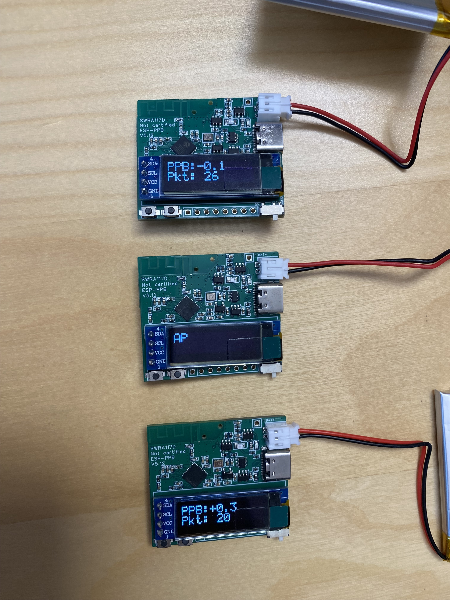

# ESP-PPB

[](LICENSE)
[](HARDWARE_LICENSE)
[](https://docs.espressif.com/projects/esp-idf/)


<p align="center">
  <a href="images/five.jpg">
    
  </a>
</p>

**ESP-PPB** is the first wireless, battery-powered, phase-coherent CSI synchronization platform for ESP32. It phase-locks any number of nodes over the air using Wi-Fi FTM and a VCTCXO disciplined by dual DACs, achieving sub-PPB clock alignment and near-phase-coherent CSI captures — no cables, no wired backhaul, no tethered power.

Drop nodes wherever you need them, power them on, and collect synchronized CSI data on your laptop over Wi-Fi.

> **Looking for hardware?** A Crowd Supply campaign is planned. In the meantime, early boards are available directly — see [Get Hardware](#get-hardware) below.

---

## Why ESP-PPB

Existing Wi-Fi CSI platforms either require cables between antennas, need a wired connection to a PC, or cannot synchronize phase across devices. ESP-PPB removes all three constraints:

| | **ESP-PPB** | **ESPARGOS** | **Intel 5300 CSI Tool** | **Atheros CSI Tool** |
|---|---|---|---|---|
| **Wireless (no cables between nodes)** | Yes | No (coax + Ethernet) | No (PCIe in PC) | Partial (OpenWRT routers) |
| **Battery powered** | Yes (~6-12 h) | No (PoE / USB-C) | No (laptop/desktop) | Possible (router battery) |
| **Phase-coherent sync** | Yes (sub-PPB) | Yes (ref clock cable) | No | No |
| **Remote data collection** | Yes (Wi-Fi) | No (Ethernet) | No (local) | Partial |
| **Max synced nodes** | Unlimited | ~4 arrays documented | N/A | N/A |
| **Antennas per node** | 1 | 8 (2x4 array) | 3 (3x3 MIMO) | Up to 3 (3x3 MIMO) |
| **Open source firmware** | Yes | Yes | No (closed binary) | Yes |
| **Actively maintained** | Yes | Yes | No (discontinued ~2011) | Limited |
| **Cost per node** | ~$50-80 | Not available | ~$5-25 (used NIC only) | ~$90-145 (router) |

**In short:** ESP-PPB is the only solution that is simultaneously wireless, battery-powered, phase-synchronized, and remotely observable — with no upper limit on the number of synced nodes.

---

## What You Can Do With It

- **Angle-of-arrival estimation** — place nodes around a room, triangulate sources
- **MUSIC / ESPRIT** and other super-resolution direction-finding algorithms
- **Multi-node phase-coherent CSI capture** — distributed virtual array
- **Distributed wireless sensing** — synchronized, cable-free, battery-powered nodes
- **Indoor localization research** — deploy and relocate freely without cable constraints

---

## How It Works

```
┌──────────┐    FTM + CSI     ┌──────────┐
│  Slave 1 │◄────────────────►│          │
│ (VCTCXO) │                  │  Master  │
└──────────┘                  │   (AP)   │
                              │          │
┌──────────┐    FTM + CSI     │          │
│  Slave 2 │◄────────────────►│          │
│ (VCTCXO) │                  └────┬─────┘
└──────────┘                       │
                                   │  Wi-Fi broadcast
      ...more slaves...            │
                              ┌────▼─────┐
                              │ Listener │  ← any ESP32 + PC
                              │   (PC)   │
                              └──────────┘
```

1. **One node acts as the AP / FTM responder** (the master clock).
2. Slave nodes initiate FTM exchanges every few hundred milliseconds (configurable).
3. A small IDF hack enables **nanosecond-level RX timestamps** via promiscuous mode.
4. Each slave estimates its clock drift (PPB slope) and corrects its **VCTCXO via dual DACs** (coarse + fine).
5. Once phase-locked, slaves exchange CSI with the AP and **broadcast results over Wi-Fi**.
6. Any listener (a cheap ESP32 connected to a PC) collects the data for post-processing.

---

## Synchronization Accuracy

| Metric | Value |
|---|---|
| Clock alignment | Sub-PPB (parts per billion) |
| Theoretical phase accuracy | < 1 degree per CSI frame |
| Practical single-frame accuracy | ~5 degrees (without averaging) |
| Battery life | ~6-12 hours (depends on FTM rate) |

---

## Hardware

<p align="center">
  <a href="images/single.jpg">
    
  </a>
  <a href="images/triple.jpg">
    
  </a>
</p>

- **ESP32-C3** with custom RF antenna tuning
- **VCTCXO** (voltage-controlled temperature-compensated crystal oscillator)
- **Dual DAC** — coarse + fine control for oscillator discipline
- **OLED display** — live accuracy and status readout
- **LiPo battery charger** (USB-C, battery not included)
- **Exposed GPIOs** for additional sensors

Full schematics, PCB layout, and 3D board model are in [`schematics/`](schematics/).

---

## Deployment

**Minimum setup:** 1 master (AP) + 2 slaves = 3 nodes.

**Typical setup:** 1 master + 4 slaves, with a listener ESP32 connected to a laptop.

Nodes auto-detect their role based on MAC address (configurable in firmware). Power them on and they synchronize automatically.

---

## Quick Start

### Prerequisites

- [ESP-IDF](https://docs.espressif.com/projects/esp-idf/) v5.x or v6.0
- USB-C cable for flashing

### Build and flash

```bash
. $IDF_PATH/export.sh
idf.py build
idf.py -p /dev/ttyUSB0 flash monitor
```

### Key files

| File | Purpose |
|---|---|
| `main/main.c` | Entry point and role selection |
| `main/helper_init.c` | Wi-Fi init, CSI, promiscuous mode |
| `main/perf.c` | FTM table, PPB slope, DAC correction |
| `main/i2c_helper.c` | OLED + DAC + I2C utilities |
| `main/constant.h` | Channel, SSID, and protocol constants |
| `hack_struct.patch` | IDF patch for nanosecond RX timestamps |

---

## Get Hardware

**Early boards are available now.** A larger batch and a Crowd Supply campaign are planned — early interest helps reserve boards at lower cost.

Contact: **`jonathan.muller12@gmail.com`** or [open a discussion](../../discussions).

The design files are in [`schematics/`](schematics/) if you want to build your own, but I recommend ordering assembled boards unless you are experienced with RF PCB design and antenna tuning.

---

<!-- Uncomment when video is ready
## Demo

[](https://www.youtube.com/watch?v=VIDEO_ID)
-->

## Licensing

| Component | License |
|---|---|
| Firmware / software | [GPL-3.0](LICENSE) |
| Hardware design files | [CC-BY-NC-SA-4.0](HARDWARE_LICENSE) |

---

## Get Involved

I'm actively looking for:

- **Researchers** who want to test in real deployments (universities, labs)
- **Feedback** on architecture, calibration, and use cases
- **Industry partners** evaluating wireless CSI for products
- **Ideas** for new sensing and synchronization workflows

[Open a discussion](../../discussions) or email **`jonathan.muller12@gmail.com`**.

---

<details>
<summary><strong>FAQ</strong></summary>

**Is this open source hardware?**
The hardware license is non-commercial (CC-BY-NC-SA-4.0), so it is source-available but not OSHWA-compliant open hardware.

**Can I build my own boards?**
Yes. The schematics and design files are in `schematics/`. If you are not experienced with RF PCB design and antenna tuning, I recommend ordering from me.

**Do I need a special access point?**
Yes. The AP must be an ESP-PPB node running the master firmware. A regular Wi-Fi router will not work.

**What's required to collect data?**
Any Wi-Fi listener can receive the broadcast data. A reference ESP32 logger connected to a PC is provided for convenience.

**How many nodes can I synchronize?**
There is no hard limit. The system has been tested with more than 5 nodes. Add as many slaves as you need.

**What ESP-IDF version do I need?**
ESP-IDF v5.x works. v6.0 is also supported.

</details>
