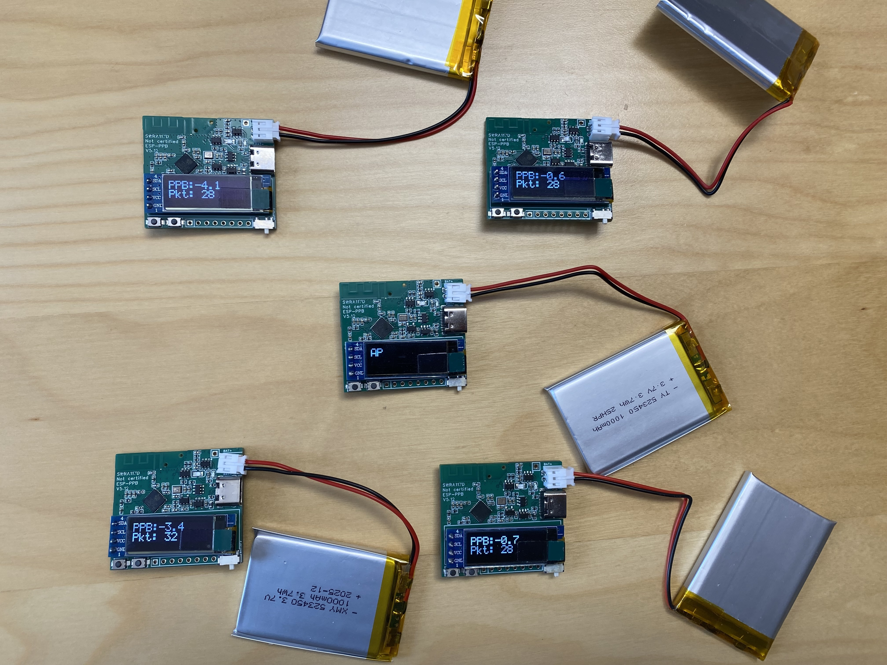
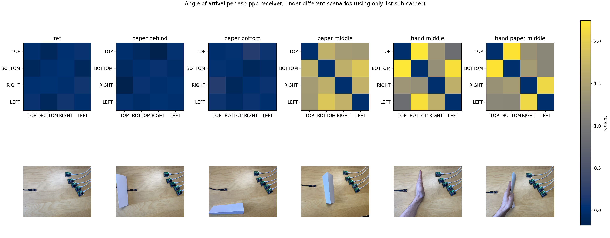
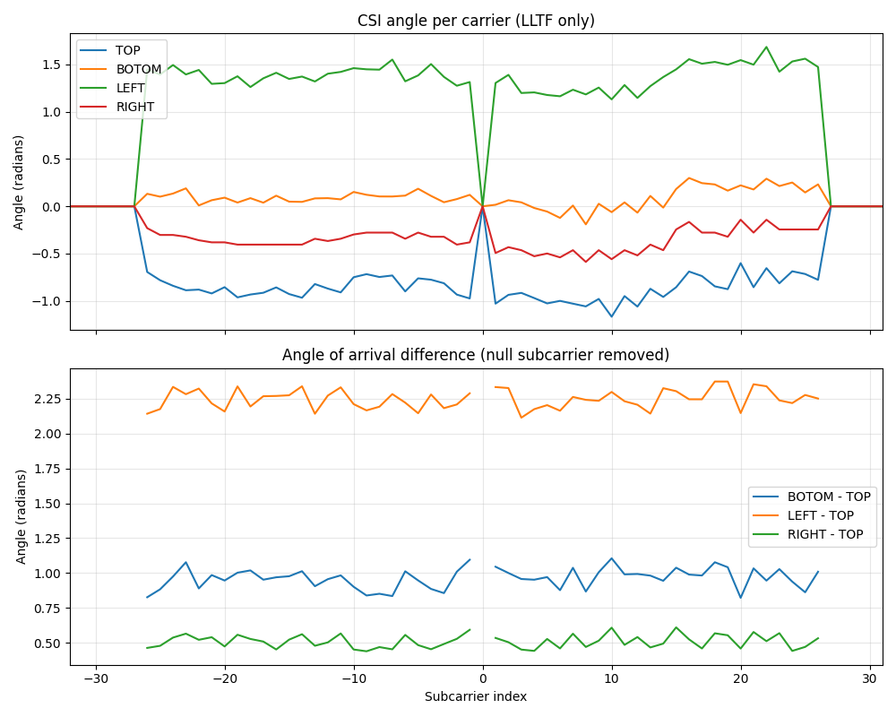
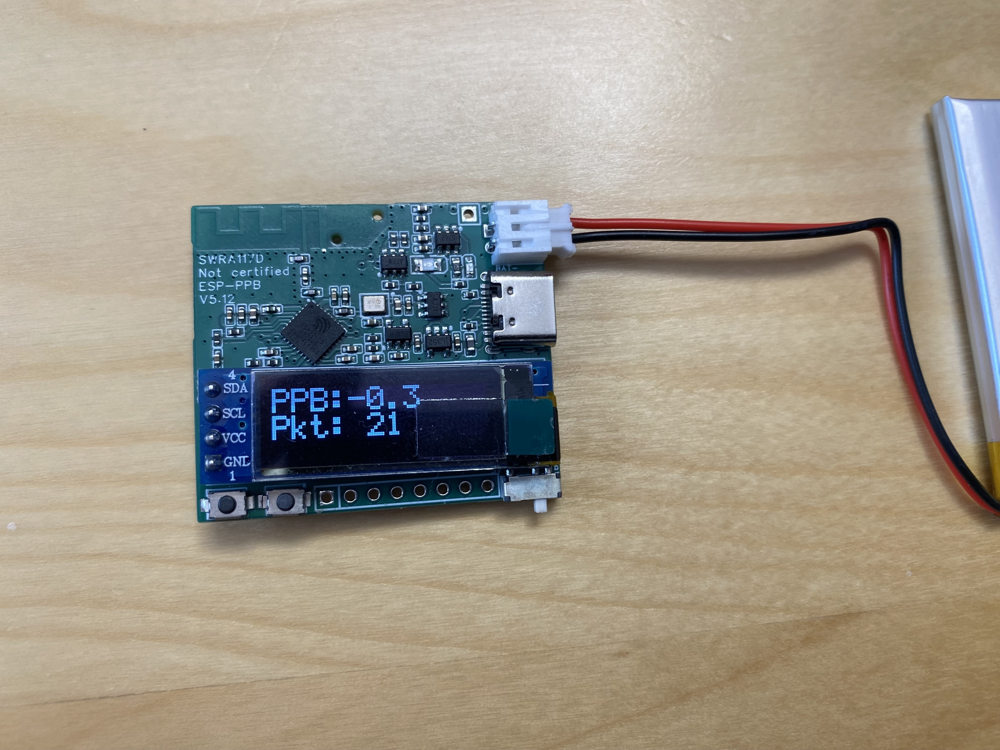

# ESP-PPB


<p align="center">
  <a href="images/five.jpg">
    
  </a>
</p>

**ESP-PPB** is the first wireless, battery-powered, phase-coherent CSI synchronization platform for ESP32.

[CSI (Channel State Information)](https://en.wikipedia.org/wiki/Channel_state_information) describes how a Wi-Fi signal propagates between transmitter and receiver, including amplitude and phase per subcarrier. Phase-coherent CSI across multiple nodes enables techniques like angle-of-arrival estimation and distributed beamforming.

ESP-PPB phase-locks any number of nodes over the air using Wi-Fi FTM and a VCTCXO disciplined by dual DACs. It achieves sub-PPB clock alignment and near-phase-coherent CSI captures: no cables, no wired backhaul, no tethered power.

Drop nodes wherever you need them, power them on, and collect synchronized CSI data on your laptop over Wi-Fi.

> **Looking for hardware?** A Crowd Supply campaign is planned. In the meantime, early boards are available directly, see [Get Hardware](#get-hardware) below.

---

## Why ESP-PPB

Existing Wi-Fi CSI platforms either require cables between antennas, need a wired connection to a PC, or cannot synchronize phase across devices. ESP-PPB removes all three constraints:

|                                        | **ESP-PPB**                  | **ESPARGOS**         | **Intel 5300 CSI Tool** | **Atheros CSI Tool**      |
|----------------------------------------|------------------------------|----------------------|-------------------------|---------------------------|
| **Wireless (no cables between nodes)** | Yes                          | No (coax + Ethernet) | No (PCIe in PC)         | Partial (OpenWRT routers) |
| **Remote data collection**             | Yes (battery powered +Wi-Fi) | No (Ethernet)        | No (local)              | Partial (router)          |
| **Max synced nodes**                   | Unlimited                    | ~4 arrays documented | N/A                     | N/A                       |
| **Antennas per node**                  | 1                            | 8 (2x4 array)        | 3 (3x3 MIMO)            | Up to 3 (3x3 MIMO)        |
| **Open source firmware**               | Yes                          | Yes                  | No (closed binary)      | Yes                       |
| **Actively maintained**                | Yes                          | Yes                  | No (discontinued ~2011) | Limited                   |
| **Cost per node**                      | ~$50-80                      | Not available        | Discontinued            | ~$90-145 (router)         |

**In short:** ESP-PPB is the only solution that is simultaneously wireless, battery-powered, phase-synchronized, and remotely observable, with no upper limit on the number of synced nodes.

---

## What you can do with it

- [**Angle-of-arrival estimation**](https://www.mdpi.com/1424-8220/18/6/1753): place nodes around a room, triangulate sources
- [**MUSIC**](https://en.wikipedia.org/wiki/MUSIC_(algorithm)) / [**ESPRIT**](https://en.wikipedia.org/wiki/Estimation_of_signal_parameters_via_rotational_invariance_techniques): super-resolution direction-finding algorithms
- [**Multi-node phase-coherent CSI capture**](https://ieeexplore.ieee.org/stamp/stamp.jsp?arnumber=9217431): build a distributed virtual array
- [**Distributed wireless sensing**](https://www.researchgate.net/profile/Yuval-Amizur/publication/273443111_Next_Generation_Indoor_Positioning_System_Based_on_WiFi_Time_of_Flight/links/5798ddd508aec89db7bb883a/Next-Generation-Indoor-Positioning-System-Based-on-WiFi-Time-of-Flight.pdf): synchronized, cable-free, battery-powered nodes
- [**Indoor localization**](https://www.academia.edu/download/35783892/3_CSI-based_Indoor_Localization_TPDS.pdf): deploy and relocate freely without cable constraints
- [**Phase-coherent WiFi sensing**](https://ieeexplore.ieee.org/document/10739065/): see also ESPARGOS, a wired ESP32-based CSI array

Wireless phase-coherent CSI is largely uncharted territory. Most existing research assumes wired synchronization. If you're looking for a paper topic, this is it.

### Examples

These were captured with ESP-PPB boards sitting on a desk in a normal room, no shielding, no lab equipment. This is the kind of data you get out of the box.

<p align="center">
  <a href="images/angle_of_arrival_matrices.png">
    
  </a>
</p>

**Angle-of-arrival matrices across scenarios.** Each heatmap shows the pairwise CSI phase difference between four ESP-PPB nodes (TOP, BOTTOM, RIGHT, LEFT) for a different physical setup: reference (no obstruction), paper placed behind/below/between nodes, and a hand in the middle. The phase pattern changes visibly with each scenario, showing that the nodes can detect the presence and position of objects.

<p align="center">
  <a href="images/aoa.png">
    
  </a>
</p>

**CSI phase per subcarrier across four synchronized nodes.** The top plot shows the raw phase angle for each node across all 52 OFDM subcarriers. The bottom plot shows the phase difference relative to the TOP node, demonstrating stable, flat phase offsets between nodes, which is the foundation for angle-of-arrival estimation.

---

## How It Works

```
┌──────────┐                     ┌──────────┐
│  Slave 1 │ ◄──────────────────►│          │
│ (VCTCXO) │─────┐          FTM  │          │
└──────────┘     │               │  Master  │
                 │               │          │
                 │               │   (AP)   │
┌──────────┐◄───────────────────►│          │
│          │     |          FTM  └──────────┘
│  Slave 2 │─────┤            
│ (VCTCXO) │     │               
└──────────┘     │
                 │  CSI data (Wi-Fi broadcast)
  ...more...─────┤
                 │
            ┌────▼─────┐
            │ Listener │  ← any ESP32 + PC
            │   (PC)   │
            └──────────┘
```

1. **One node acts as the AP / FTM responder** (the master clock).
2. Slave nodes initiate FTM exchanges every few hundred milliseconds (configurable).
3. A small IDF hack enables **nanosecond-level RX timestamps** via promiscuous mode.
4. Each slave estimates its clock drift (PPB slope) and corrects its **VCTCXO via dual DACs** (coarse + fine).
5. Once phase-locked, slaves exchange CSI with the AP and **broadcast results over Wi-Fi**.
6. Any listener (a cheap ESP32 connected to a PC) collects the data for post-processing.

---

## Synchronization Accuracy

| Metric                      | Best case (lab) | Typical (real world)              |
|-----------------------------|-----------------|-----------------------------------|
| Clock alignment             | < 0.1 PPB       | ~1 PPB                            |
| Single-frame phase accuracy | < 1 degree      | < 10 degrees                      |
| Time to 10 PPB lock         | Instant         | Seconds                           |
| Time to < 1 PPB lock        | Seconds         | Minutes (needs thermal stability) |

---

## Hardware

<p align="center">
  <a href="images/single.jpg">
    
  </a>
  <a href="images/five.jpg">
    
  </a>
</p>

- **Compact**: under 4 cm x 4 cm, 5+ PCB revisions refined
- **ESP32-C3** with custom RF antenna tuning (2.4 GHz)
- **VCTCXO** (voltage-controlled temperature-compensated crystal oscillator)
- **Dual DAC**: coarse + fine control for oscillator discipline
- **OLED display**: live accuracy and status readout
- **LiPo battery charger** (USB-C, battery not included), ~8 h runtime with a 1000 mAh battery (120 mA draw)
- **6 exposed GPIOs**: connect your own sensors, actuators, or peripherals (see [Exposed IO](schematics/README.md))

Full schematics, PCB layout, and 3D board model are in [`schematics/`](schematics/).

**Limitations:** each node has a single antenna, so spatial diversity requires multiple nodes.

---

## Quick Start

**Minimum setup:** 1 master (AP) + 2 slaves = 3 nodes. **Typical setup:** 1 master + 4 slaves, with a listener ESP32 connected to a laptop. Nodes auto-detect their role based on MAC address (configurable in firmware). Power them on and they synchronize automatically.

### Build and Flash

**Hardware:**

- At least 3 ESP-PPB boards
- Optional: a LiPo battery (PH2.0 - 2P plug) :warning: Watch the polarity. The `bat+` label on the board marks the positive side of the battery. This battery is compatible, for example: [AliExpress option](https://de.aliexpress.com/item/1005008790388830.html?spm=a2g0o.order_list.order_list_main.37.40f35e5b8iBkc5&gatewayAdapt=glo2deu)
- Make sure the switch on your ESP-PPB is set to `battery` or `5V`, depending on whether you are using a battery

**Software:**

- [Espressif ESP32 tutorial](https://docs.espressif.com/projects/esp-idf/en/stable/esp32/get-started/index.html)

**Flash for the first time:**

```bash
. $IDF_PATH/export.sh
idf.py build
idf.py -p /dev/ttyUSB0 flash monitor
```

When the device boots, note its STA MAC address:

```
2026-02-20 08:26:31 I (786) [./main/helper.c:74] [MIDDLE]: STA MAC is {0x00, 0x00, 0x00, 0x00, 0x00, 0x00}
```

Edit [`main/helper.h`](main/helper.h) and set `MAC_STA_RIGHT` / `MAC_STA_TOP` / `MAC_STA_MIDDLE` / ... depending on your need (see the [Roles](#roles) section below).

### Key files

| File                 | Purpose                                |
|----------------------|----------------------------------------|
| `main/main.c`        | Entry point and role selection         |
| `main/helper_init.c` | Wi-Fi init, CSI, promiscuous mode      |
| `main/perf.c`        | FTM table, PPB slope, DAC correction   |
| `main/i2c_helper.c`  | OLED + DAC + I2C utilities             |
| `main/constant.h`    | Channel, SSID, and protocol constants  |
| `hack_struct.patch`  | IDF patch for nanosecond RX timestamps |

---

## Get Hardware

**Early boards are available now.** A larger batch and a Crowd Supply campaign are planned. Early interest helps reserve boards at lower cost.

Contact: **`jonathan.muller12@gmail.com`** or [open a discussion](../../discussions).

The design files are in [`schematics/`](schematics/) if you want to build your own, but I recommend ordering assembled boards unless you are experienced with RF PCB design and antenna tuning.

---

## Get Involved

> **This project thrives on early feedback.** Whether you're a researcher, engineer, or hobbyist, your input shapes the next revision.

| # | How to contribute                                            |
|---|--------------------------------------------------------------|
| 1 | **Try it**: request a board and test in your environment     |
| 2 | **Report**: share results, bugs, or calibration observations |
| 3 | **Suggest**: propose new use cases or features               |
| 4 | **Collaborate**: co-author research, co-develop algorithms   |

[Open a discussion](../../discussions) or email **`jonathan.muller12@gmail.com`**.

---

## FAQ

<details>
<summary>Do I need a special access point?</summary>

An ESP-PPB node as AP gives the best results (built-in FTM sync). A regular Wi-Fi router also works, but you'll need an external ESP32 (doesn't have to be ESP-PPB) to send a sync frame alongside each CSI frame.

</details>

<details>
<summary>What's required to collect data?</summary>

Any Wi-Fi listener can receive the broadcast data. A reference ESP32 logger connected to a PC is provided for convenience.

</details>

<details>
<summary>How many nodes can I synchronize?</summary>

There is no hard limit. The system has been tested with more than 5 nodes. Add as many slaves as you need.

</details>

<details>
<summary>What ESP-IDF version do I need?</summary>

ESP-IDF v5.x works. v6.0 is also supported.

</details>

---

## Roadmap

- [x] First prototype
- [x] Prototype validation
- [x] Multi-revision PCB refinement (5+ revisions)
- [x] Sub-PPB synchronization demonstrated
- [x] Multi-node deployment tested (5+ nodes)
- [x] Open source firmware release
- [ ] **Early production** ← *you are here*
- [ ] Crowd Supply campaign
- [ ] Python post-processing examples (AoA, MUSIC)
- [ ] Extended documentation and tutorials

---

## Code Architecture

<details>
<summary>Details</summary>

Each node selects its role at boot based on its MAC address (`main/main.c`). The role determines which callbacks and loop function are registered.

### Roles

| Role               | MAC match                        | Wi-Fi mode   | Description                                                         |
|--------------------|----------------------------------|--------------|---------------------------------------------------------------------|
| **Slave (FTM)**    | `LEFT`, `RIGHT`, `TOP`, `BOTTOM` | Station      | Syncs to master via FTM, captures and broadcasts CSI                |
| **Master (AP)**    | `MIDDLE`                         | Access Point | Runs FTM responder, responds to CSI pings                           |
| **Default client** | Any other MAC                    | Station      | Receives and logs broadcast data from slaves (listener / PC bridge) |

### Callbacks and main loops

| Function           | Registered as           | Role    | Trigger                         | What it does                                                                            |
|--------------------|-------------------------|---------|---------------------------------|-----------------------------------------------------------------------------------------|
| `promi_ftm_cb`     | Promiscuous RX callback | Slave   | Every received management frame | Extracts nanosecond RX timestamps from FTM frames for clock drift estimation            |
| `csi_send_summary` | CSI RX callback         | Slave   | Every CSI frame received        | Packages CSI + timing data and broadcasts it over Wi-Fi                                 |
| `infinite_ftm`     | Main loop               | Slave   | Runs continuously               | Initiates FTM exchanges with the AP, estimates PPB drift, corrects VCTCXO via dual DACs |
| `csi_ping_pong`    | CSI RX callback         | Master  | CSI frame from a slave          | Immediately responds with a CSI frame back (anchors phase for the slave)                |
| `print_now_recv`   | ESP-NOW RX callback     | Default | ESP-NOW packet received         | Logs received data (used by the listener / PC bridge)                                   |
| `simple_send_cb`   | ESP-NOW TX callback     | Default | After sending an ESP-NOW packet | Logs TX rate for debugging                                                              |
| `infinite_send`    | Main loop               | Default | Runs continuously               | Sends ESP-NOW packets in a loop (test / relay mode)                                     |

### Boot sequence (`app_main`)

```
1. Print MAC address
2. Init GPIO9 interrupt (button)
3. Init I2C → OLED → DACs (reset VCTCXO)
4. Detect role from MAC address
5. Init Wi-Fi (AP or Station)
6. Register callbacks (promiscuous, CSI, ESP-NOW)
7. Enter main loop (if any)
```

</details>

---

## Licensing

<details>
<summary>Details</summary>

| Component             | License                             |
|-----------------------|-------------------------------------|
| Firmware / software   | [GPL-3.0](LICENSE)                  |
| Hardware design files | [CC-BY-NC-SA-4.0](HARDWARE_LICENSE) |

</details>

---

## Cite

<details>
<summary>Details</summary>

If you use ESP-PPB in academic work, please cite:

```bibtex
@misc{muller2025espppb,
  author       = {Jonathan Muller},
  title        = {{ESP-PPB}: Wireless Battery-Powered Phase-Coherent {CSI} Synchronization Platform},
  year         = {2025},
  howpublished = {\url{https://github.com/jonathanmuller/esp-ppb}},
}
```

</details>
