# Schematics Folder Guide

This folder holds the board documentation assets. The goal is simple: give you everything you need to understand the hardware without opening the CAD tools.

## Quick Start

If you are new:

1. Start with `pcb.png` to see the full board layout.
2. Then open `esp32_c3.png` to understand the MCU wiring.
3. Use `power_switch.png`, `LDO.png`, and `usb_c.png` to follow power flow.
4. Check `battery_charge.png` and `voltage_dividers.png` to understand battery measurement.
5. Finally look at `oled.png` and `I2c.png` for the display and I2C wiring.

## Usage

<strong>Board Layout</strong>

Overall board layout. Use this to locate components and understand where connectors, buttons, and signals physically sit.

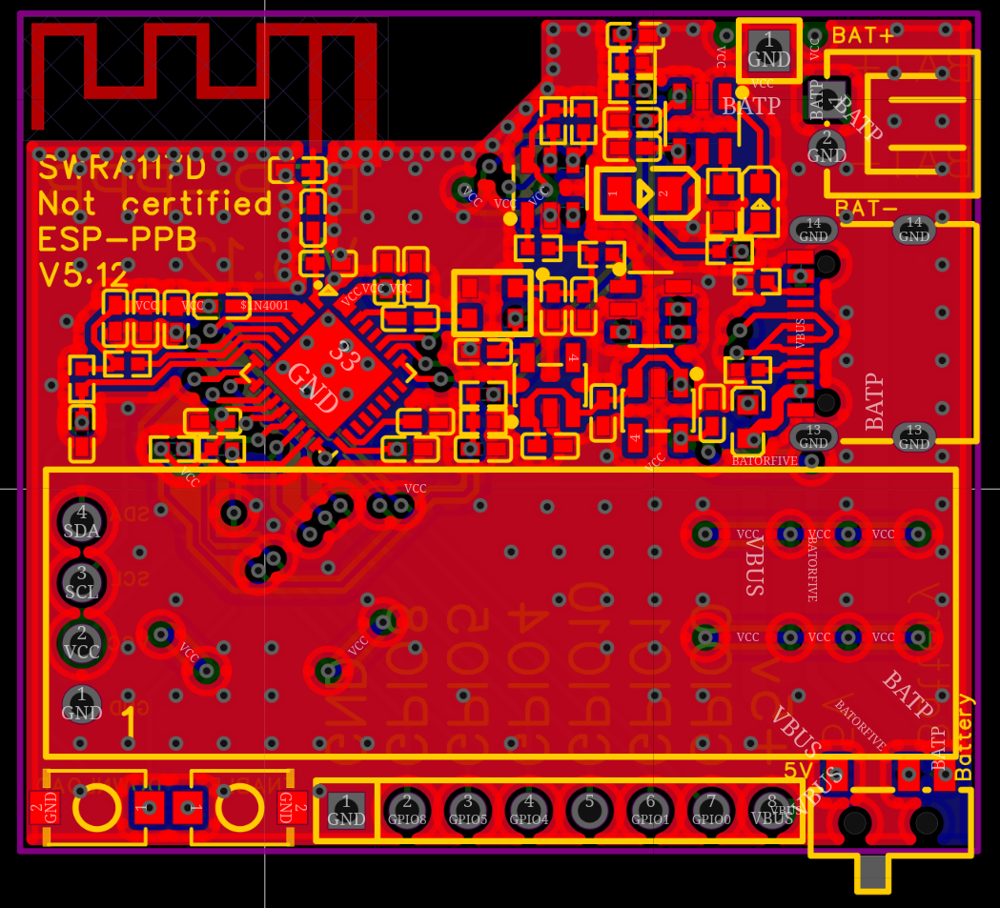

<strong>ESP32-C3 Microcontroller</strong>

Microcontroller wiring. This is the heart of the design. It shows which GPIOs are used, how the crystal is connected, and where power and reset lines go. Use it to map firmware pins to hardware signals.

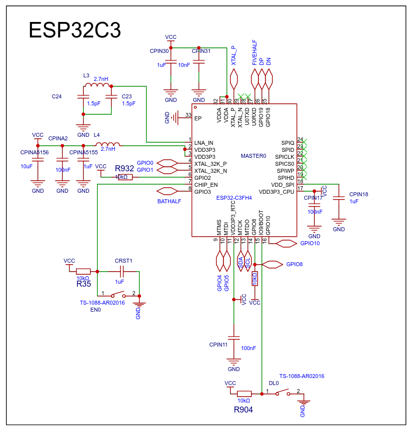

<strong>Exposed IO / Test Points</strong>

Exposed headers or test points. Use this to find accessible signals for probing, flashing, or expansion.

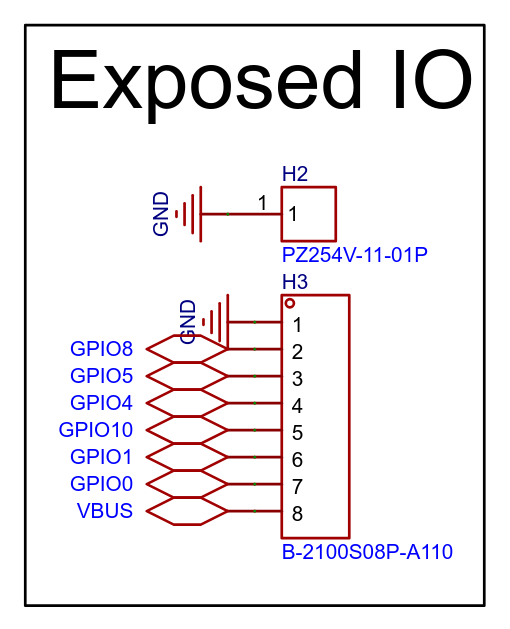

<strong>USB-C Connector</strong>

USB-C connector wiring. Use this to see how 5V enters the board and what pins are connected. Helpful when debugging power input or USB wiring.

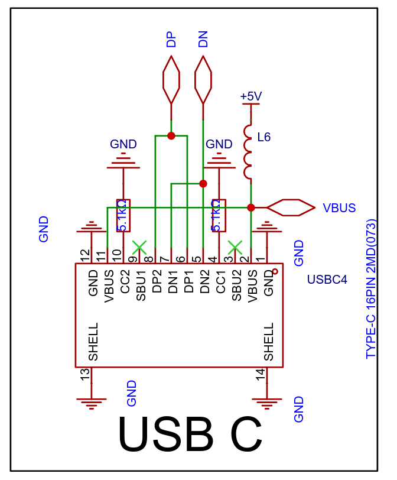

<strong>Power Switch</strong>

Power switch circuit. Follow how the board enables/disables power and which nets are switched. Useful if the device does not boot or power cycles.

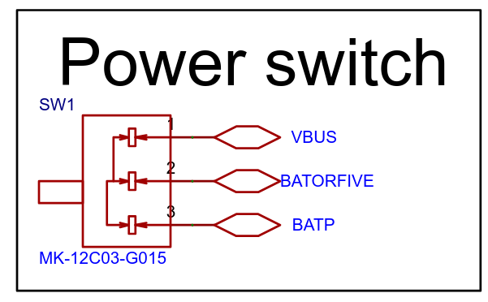

<strong>LDO Regulator</strong>

Voltage regulator (LDO). This shows how the board converts input power down to the logic voltage. Use this when verifying power rails or checking for voltage drop.

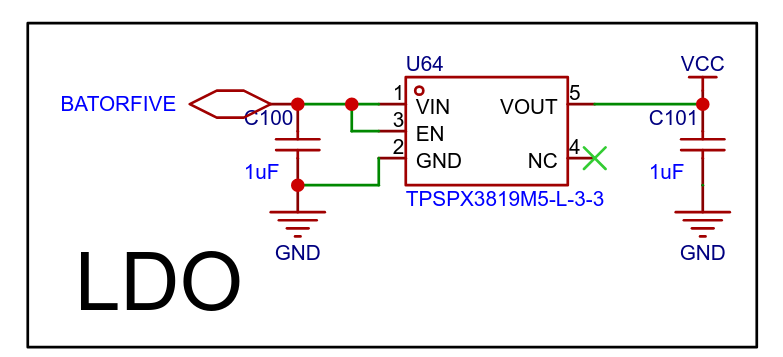

<strong>Battery Charger</strong>

Battery charging circuit. Useful if you are debugging charging, battery safety, or powering the board from a LiPo.

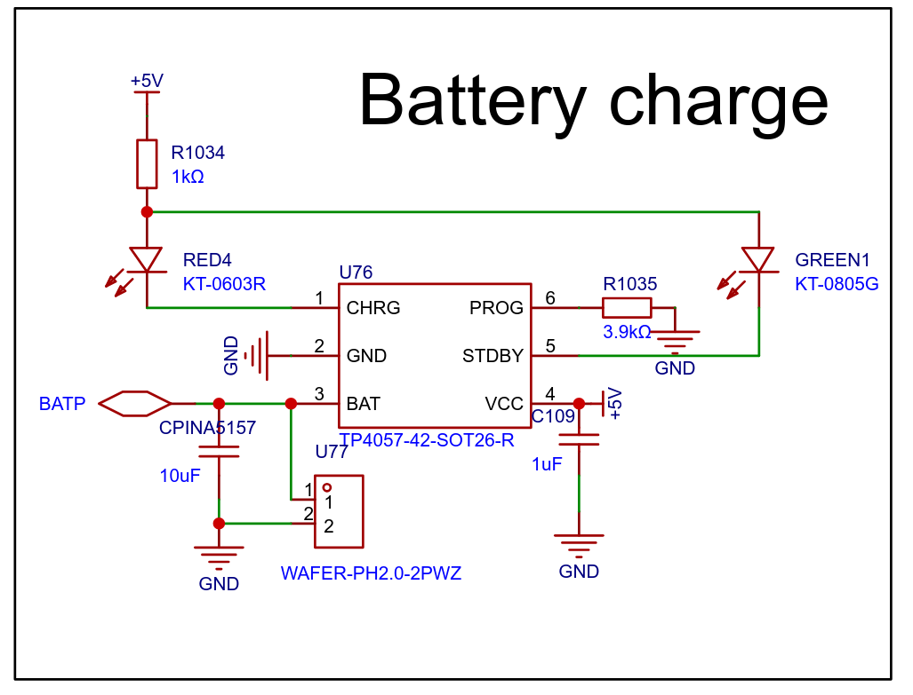

<strong>Voltage Dividers</strong>

Voltage dividers used for measurement (for example, battery sense). This is where the ADC scaling is defined, so it directly impacts calculated battery voltage.

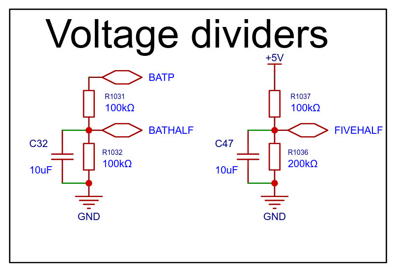

<strong>I2C Bus</strong>

I2C bus wiring. Shows which devices live on the I2C bus and how they are connected. Use this when debugging OLED/DAC access or bus contention.

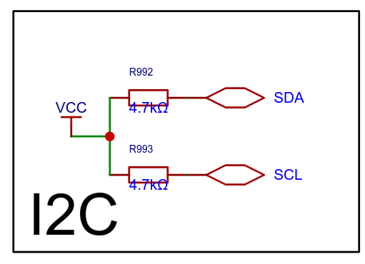

<strong>TCXO and Dual DAC</strong>

Clock and DAC circuitry. This is relevant if you are working on timing precision or DAC calibration. It shows how the reference clock is tuned and how corrections are applied.

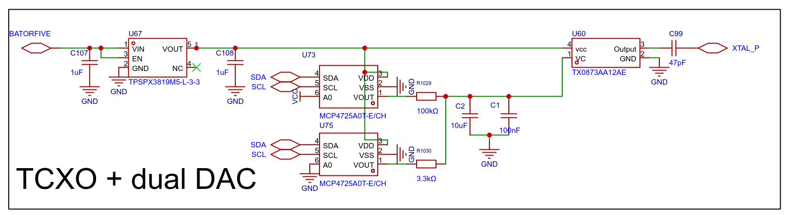

<strong>OLED Display</strong>

OLED display wiring. Use this when debugging the display or changing screen wiring. Shows power, reset, and I2C pins.

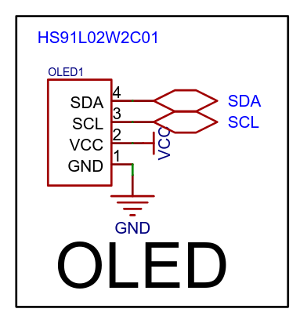

<strong>3D Board Model</strong>

- `3d_view.obj`: 3D geometry.
- `3d_view.mtl`: material definition.

You can open the OBJ in most 3D viewers (Blender, FreeCAD, etc.) to see the assembled board in 3D.

<strong>Altium Sources</strong>

There are two sources here:

- `altium.zip`: full Altium project archive. This is the source of truth.

If you need to edit the schematic or PCB:

1. Prefer `altium.zip`.
2. Unzip it and open the project in Altium Designer.

