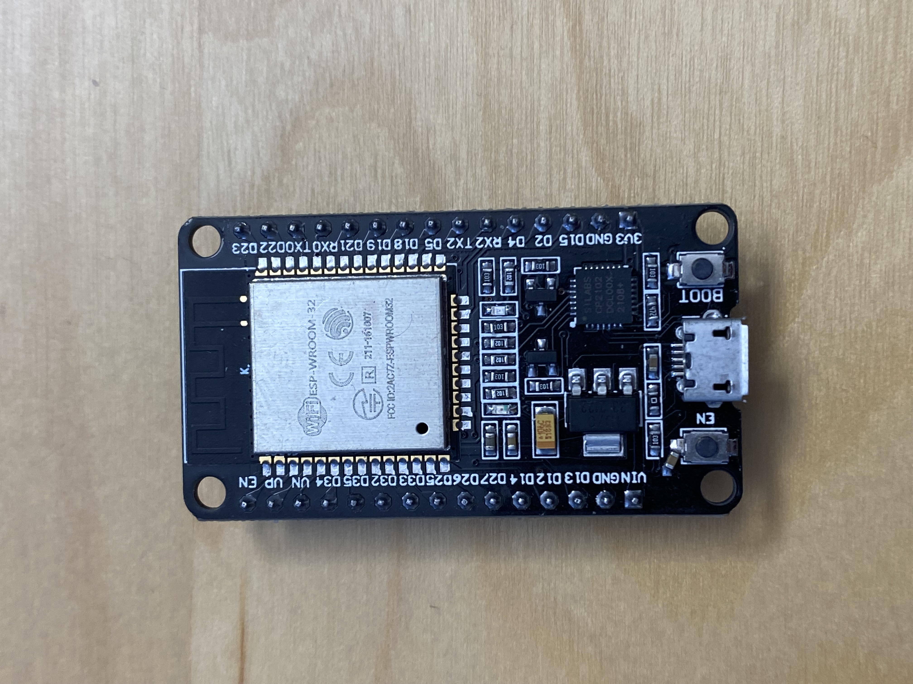
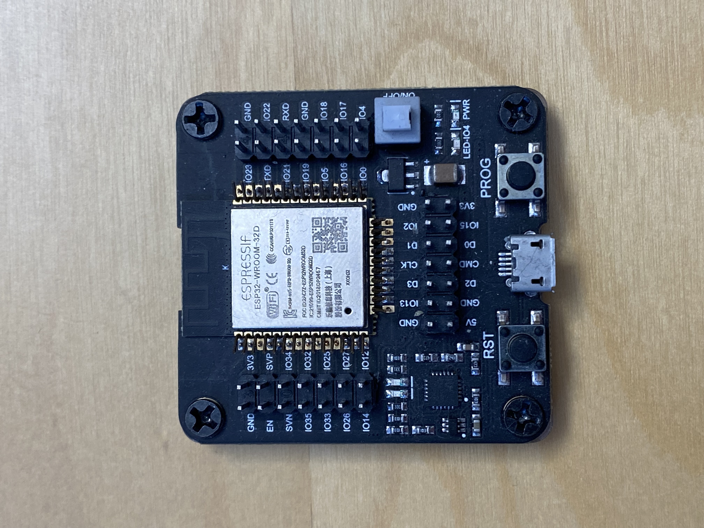
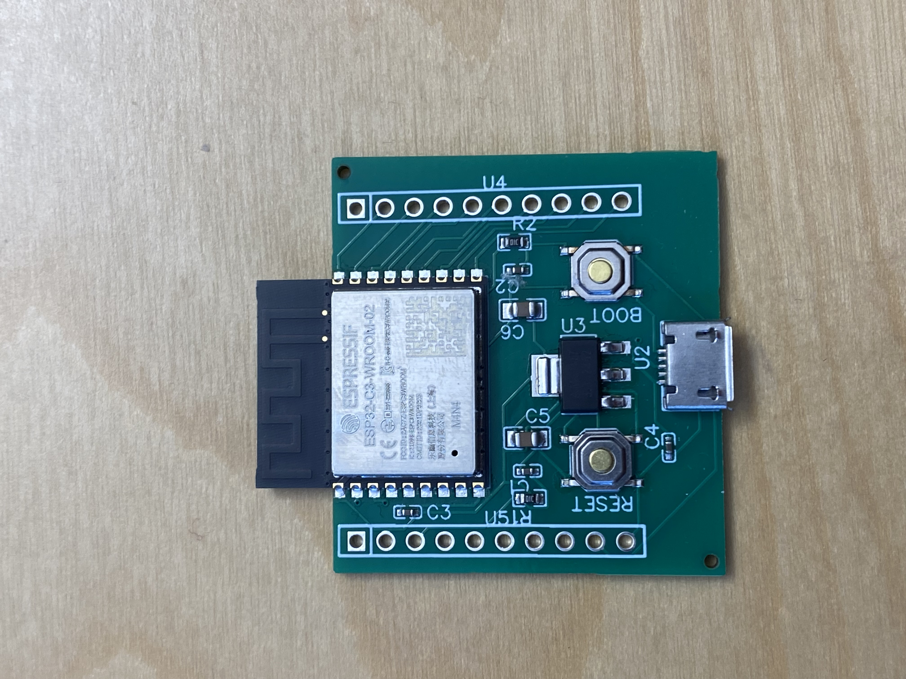
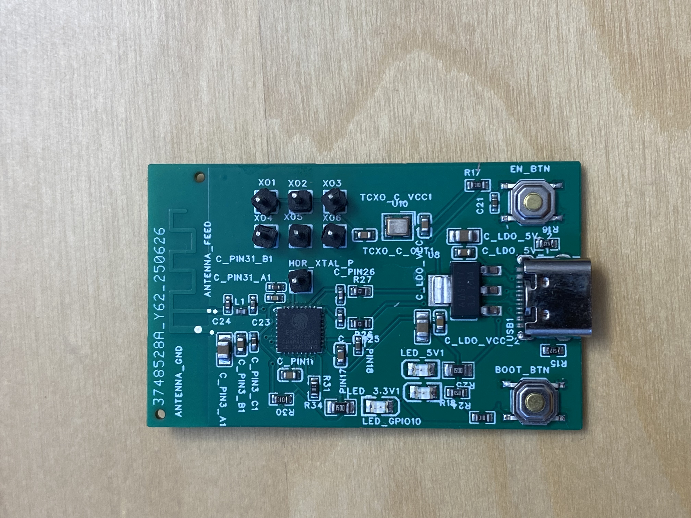
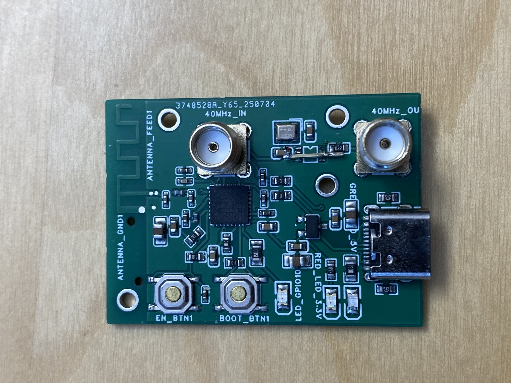
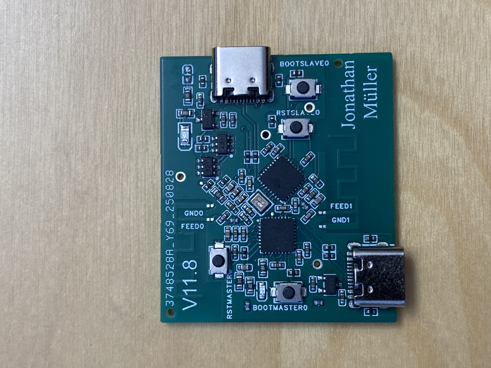
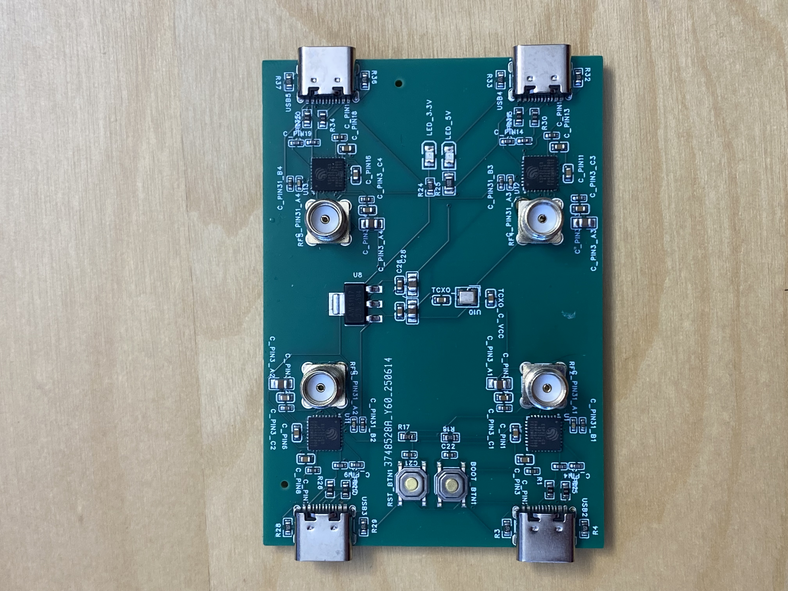
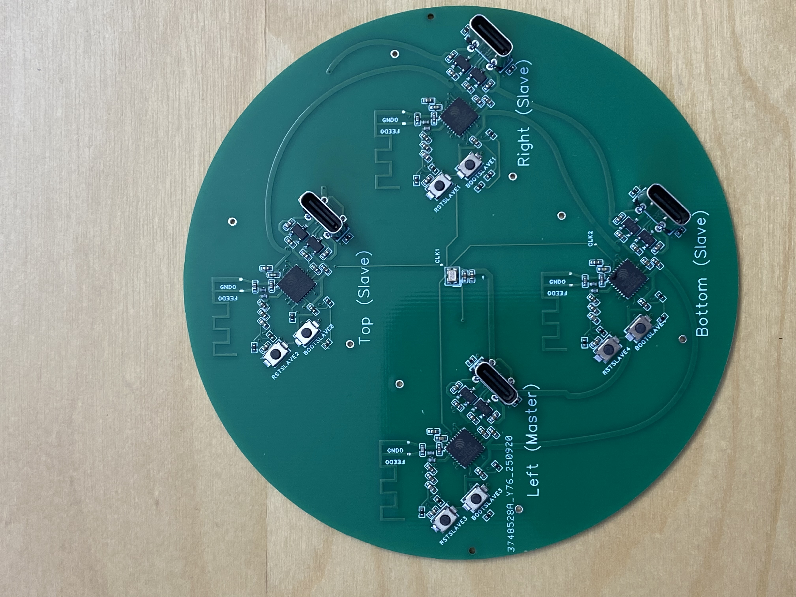
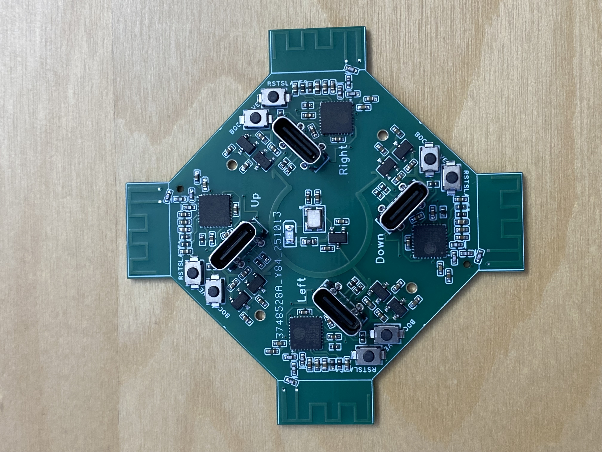
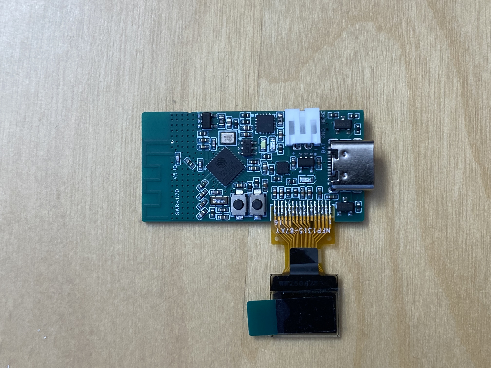

# History and Lessons: 10 boards, 10 years

Building ESP-PPB took 10 board revisions over roughly 10 years, many dead ends, and a lot of wasted time. This page documents every iteration so you don't have to repeat the same mistakes. If you're working on wireless synchronization, clock disciplining, or RF PCB design, this might save you months.

---

### Board 1: The Aliexpress dev kit

<table><tr><td width="400">

</td><td>

I had just finished my master thesis on Wi-Fi security (can't say more, NDA). The conclusion was clear: you can spoof almost anything in Wi-Fi, *except* the physical layer properties (RSSI, CSI, clock drift). CSI phase seemed the most promising path to angle-of-arrival, so I grabbed two off-the-shelf ESP32 dev kits and started experimenting.

I found a Chinese repo that hijacked the ESP-IDF `esp_wifi_80211_tx` function to send raw action frames at the fastest rate, about 1 frame per ms. I learned how to send and capture CSI, and published [ESP32-gather-channel-state-information-CSI](https://github.com/jonathanmuller/ESP32-gather-channel-state-information-CSI-) to help others get started. That repo was a great success.

But the CSI phase itself was pure noise. Typical ESP32 dev boards use 10 to 20 ppm crystal oscillators. Two boards can have a frequency offset of up to 20 ppm between them. The phase error from a constant frequency offset accumulates linearly:

`Δφ = 2π × f_carrier × (Δf/f) × τ = 2π × 2.4 GHz × 10 ppm × 1 ms ≈ 150 rad ≈ 8640°`

That's about 24 full rotations of phase between consecutive frames. Indistinguishable from random.

I only learned much later that the right way to separate this is: deterministic offset vs random wander. The 10 ppm spec is a constant fractional frequency offset term, while [Allan deviation](https://en.wikipedia.org/wiki/Allan_variance) σ_y(τ) measures random stability over averaging interval τ. For Allan-driven wander, the time error between two clocks is:

`σ_x(τ) = σ_y(τ) × τ`

And the phase error at carrier frequency f is:

`σ_φ(τ) = 2π × f × σ_x(τ) = 2π × f × σ_y(τ) × τ`

A pessimistic cheap-oscillator value is around σ_y(1s) ≈ 1e-8. If you assume white-FM behavior, then σ_y(1ms) ≈ 1e-8 / sqrt(1e-3) ≈ 3.16e-7. At 2.4 GHz and τ = 1 ms:

`σ_φ(1ms) = 2π × 2.4 GHz × 3.16e-7 × 1 ms ≈ 4.76 rad ≈ 273° rms`

Still terrible. So even without the deterministic ppm term, random short-term wander alone is enough to wreck phase coherence.

**Lesson:** 10 to 20 ppm clocks are completely useless for phase-coherent CSI. You need orders of magnitude better.

</td></tr></table>

---

### Board 2: The Chinese flasher

<table><tr><td width="400">

</td><td>

Before designing my own PCB I wanted to make sure I could flash bare ESP32-WROOM modules (the ones with the 40 MHz crystal embedded). I got this Chinese flasher board, dropped the module in, and tried USB first, then UART with a USB-to-UART bridge. Both worked fine. Good confidence builder.

Same 10 to 20 ppm clock though, so CSI was still useless.

**Lesson:** flashing is easy. The clock is the bottleneck, not the toolchain.

</td></tr></table>

---

### Board 3: First custom PCB

<table><tr><td width="400">

</td><td>

I had never made a PCB before. I chose [EasyEDA](https://easyeda.com) (which integrates with [JLCPCB](https://jlcpcb.com)) because it had a lot of tutorials and seemed the simplest option. I relied entirely on its auto-router.

The image you see is actually the Nth board I ordered, because I tried to hand-solder the first ones and completely botched them. I then switched to putting a bit of solder paste on each pad and using a cheap Chinese hot plate. That worked beautifully: just place components under a microscope, heat, done. Way better than hand soldering, especially for the ground pad under the ESP32-WROOM which is impossible to reach with an iron.

Same clock, same results. No improvement on CSI.

**Lesson:** solder paste + hot plate is the way. Don't hand-solder QFN packages. Auto-routing works fine for simple boards.

</td></tr></table>

---

### Board 4: The clock sharing attempt

<table><tr><td width="400">

</td><td>

From this board on, all boards were assembled by [JLCPCB](https://jlcpcb.com). It took me so long to solder the previous ones that I didn't want to do it again, especially with smaller components and more of them. Worth every penny for my sanity.

The simplest idea seemed to be sharing a single 40 MHz clock across multiple ESP32 boards via jumper wires. You can see the clock output has many jumper headers to connect to other boards, and each board has a single header for clock input.

I also upgraded to a 0.5 ppm TCXO, figuring even if clock sharing failed, at least each board would have a better clock. I learned that the ESP32 accepts a clock two ways: either a crystal on XTAL_P/XTAL_N (the internal oscillator drives it), or a full external oscillator on XTAL_P alone.

I also switched to the ESP32-C3 around this time. It was the cheapest and simplest ESP32 variant, and critically, it supports Wi-Fi FTM (Fine Timing Measurement), which the original ESP32 does not. This matters because I discovered nanosecond RX timestamp fields hidden in the ESP-IDF Wi-Fi structs (see [`hack_struct.patch`](hack_struct.patch)), but they only work on chips with FTM support (ESP32-C3 and later). I also found the [ESPARGOS](https://espargos.net) project on the Espressif forum.

The TCXO driving a single ESP32 worked, though not perfectly stable. 0.5 ppm was a huge improvement over 10 ppm. Using the deterministic offset formula (I'll keep using this one because the numbers are given on the datasheet and it's easier to calculate, but keep in mind Allan deviation is what actually matters for short-term stability, and higher quality oscillators like TCXOs have much better Allan deviation than their accuracy spec suggests):

`Δφ = 2π × 2.4 GHz × 1 ms × 0.5 ppm ≈ 7.5 rad ≈ 430°`

Still more than a full rotation per frame, but getting closer. With nanosecond timestamps I could now measure inter-board clock drift precisely, confirming about 0.1 ppm drift between two boards each on their own 0.5 ppm TCXO.

But sharing the clock via jumper wires didn't work at all. On the oscilloscope, connecting two wires to the TCXO output killed the signal. The parasitic capacitance of the wires was loading it down. Even touching a finger near the wire had the same effect. Shorter wires didn't help.

**Lesson:** clock distribution is a signal integrity problem. The capacitive load of even short wires destroys the signal. But the real win from this board was discovering the ESP32-C3's nanosecond timestamps and FTM support, which became the foundation of everything that followed.

</td></tr></table>

---

### Board 5: The SMA experiment

<table><tr><td width="400">

</td><td>

I thought SMA cables and a splitter would solve the clock distribution problem. Proper 50 ohm impedance, shielded, clean. I also added a CMOS clock buffer after the TCXO to increase driving strength.

The clock buffer didn't work. The TCXO output levels were too low for the CMOS buffer's input thresholds (wrong part choice). You can see on the image I ended up bypassing it entirely.

The SMA cable was even worse than jumper wires. The coax capacitance was enormous, and even a direct SMA-to-clock connection on a single board didn't work reliably. The splitter was completely hopeless. I still don't fully understand why SMA was worse than bare wire. I suspect the shared shield/ground of the coax created additional coupling paths.

**Lesson:** SMA is designed for RF, not for distributing a 40 MHz clock to high-impedance CMOS inputs. Using the wrong clock buffer is worse than using none. This board was a complete waste.

</td></tr></table>

---

### Board 6: As close as possible

<table><tr><td width="400">

</td><td>

I had just wasted an expensive board and this project was getting costly. Each revision cost more than the last. So I really wanted this one to work, and to take as little risk as possible.

I was still relying on EasyEDA's auto-router, and it was a pain. This was the last board where I used it. For every board after this one I did painful manual routing, and it was absolutely worth it.

The idea: stop trying to share a clock over cables. Instead, put two ESP32 chips on the same PCB with a single TCXO placed as physically close as possible. You can see on the image that it's really *as close as possible*. Minimal trace length, no cables, no connectors.

This was also my first attempt at a PCB antenna, using the TI AN043 inverted-F design ([SWRA117D](https://www.ti.com/lit/an/swra117d/swra117d.pdf)). I picked PCB antenna over ceramic because it's cheaper, doesn't need soldering, and supposedly easier to tune (I had no idea how to tune either one). I used typical matching values from the app note, ignored the recommendation for 4-layer PCB (I used 2), and crossed my fingers.

And it worked! With the TCXO millimeters away from both ESP32 inputs, the signal was clean. CSI phase was coherent for the first time. I could see real phase relationships between the two chips.

But the PCB antenna could receive and not transmit. The matching was completely wrong for a 2-layer stack-up. The phase had about 30 degrees of noise per measurement, and I measured a slow drift of about 1 ns per second (1 ppb) between the two ESP32s using the nanosecond timestamps. This drift comes from thermal differences: even on the same PCB, the two chips aren't at exactly the same temperature, so the shared clock affects them slightly differently. I could see this 1 ppb drift directly in
the CSI phase when sending calibration frames followed by measurement frames as fast as possible.

**Lesson:** short traces work for clock sharing, but even a shared clock drifts at about 1 ppb due to thermal gradients between chips. Also: PCB antennas on a 2-layer board won't transmit. The 4-layer recommendation is not optional.

</td></tr></table>

---

### Board 7: Four ESP32s, external antennas

<table><tr><td width="400">

</td><td>

I wanted 4 ESP32s in sync. Since I still didn't know how to tune a PCB antenna (but knew it was the problem), I went back to external antennas with SMA connectors and off-the-shelf antennas.

It was a catastrophe. The board was underpowered because I was sharing LDOs across chips, and you can't parallel LDOs like that. Only 2 out of 4 ESP32s could run at the same time. Performance was no better than Board 6. The external antennas were bulky, expensive, and annoying to work with.

One good thing came out of it though: I learned how to use ESP-NOW to send action frames. By pushing the rate to the maximum you can get about 100 us between two consecutive frames. This became my standard way to measure clock drift from now on: send continuous frames in 100 us bursts, record how the CSI phase difference changes over time, and see how stable it is.

**Lesson:** don't parallel LDOs, each chip needs its own regulator. But the real takeaway was ESP-NOW at 100 us burst rate as a measurement tool for clock drift.

</td></tr></table>

---

### Board 8: Four PCB antennas, no ground under clock

<table><tr><td width="400">

</td><td>

Back to PCB antennas, still 4 chips, power issue fixed (dedicated LDO per chip). I tried everything to clean up the design: removed the ground plane under the TCXO traces, routed clock lines as straight and clean as possible, and used a pin-compatible VCTCXO (the TCXO was out of stock) with the voltage control pin unconnected.

All 4 ESP32s ran, but same antenna problems (2-layer, can't transmit), and the clock signal had glitches with missing edges on the oscilloscope. Massive interference everywhere.

**Lesson:** no ground plane under clock traces makes things worse, not better. Clean traces alone don't fix a fundamentally noisy design. Four ESP32s on a 2-layer PCB with shared ground is an interference nightmare.

</td></tr></table>

---

### Board 9: Four layers, proper matching

<table><tr><td width="400">

</td><td>

Time to do it right. 4-layer PCB from JLCPCB, properly calculated antenna matching using [JLCPCB's impedance calculator](https://jlcpcb.com/pcb-impedance-calculator), decoupled power (each ESP32 has its own regulator, only 5V is shared on the middle section you can see), and antennas protruding beyond the board edge.

This is where I finally understood *why* 4 layers matter. On a 2-layer PCB, the distance between the signal trace (L1) and ground (L2) is large, so coupling is loose. The calculator told me I needed about 1 cm clearance between antenna traces and ground on the same layer, which felt absurd. On 4 layers, L1 (signal) and L2 (ground) are very close together, giving tight coupling and sensible trace dimensions. Everything clicked. All 4 ESP32s ran in phase sync.

But the antennas had terrible TX performance, about 20 dB worse than a Chinese dev kit or ESP32-WROOM module, and heavy mutual coupling. Touching one antenna affected all the others. The root cause: all four antennas shared the same ground plane. PCB antennas use the ground as part of the radiating structure, so shared ground means shared antennas. I measured a lot of stuff with this board, and that was the fundamental problem.

**Lesson:** you cannot put multiple PCB antennas on the same ground plane and expect them to be independent. Shared ground = coupled antennas. This is the fundamental limit of multi-ESP32 single-PCB designs.

</td></tr></table>

---

### Board 10: The VCTCXO breakthrough

<table><tr><td width="400">

</td><td>

I thought about it differently. I want 4 ESP32s in sync, sharing the same clock, but I do NOT want any coupling between them. If sharing ground couples antennas, and sharing clocks requires sharing ground, then maybe I shouldn't share the exact same signal. Maybe I could share a "look-alike" signal instead. Each node gets its own VCTCXO, and I use FTM (Fine Timing Measurement) over the air to measure clock drift, then discipline each VCTCXO with a 12-bit DAC. I also added an OLED screen and LiPo
charging to make the nodes portable.

The control loop is dead simple: do an FTM exchange, which gives you both master and slave clock timestamped at 1 ns accuracy. Do it again 1 second later. If one clock did more cycles than the other, lower the DAC voltage by 1 bit. If not, increase by 1 bit. That's it.

It worked. Each node ran independently with its own clock, and the DAC-controlled VCTCXO loop locked to about 10 ppb. No more antenna coupling, no more ground sharing problems, no more interference.

But 10 ppb was the floor. A single DAC step moved the ESP32 clock by about 10 ppb (12-bit DAC over 0.5 ppm range should give about 0.12 ppb/step in theory, but in practice it was much coarser). Thermal sensitivity was extreme: blowing on the board caused 100+ ppb drift instantly.

I also discovered something weird: the CSI phase slope (which partially represents the frequency delta between sender and receiver) was not changing linearly with the VCTCXO voltage. It made no sense until I learned about CFO (Carrier Frequency Offset). The ESP32 already estimates the frequency mismatch between sender and receiver internally, based on the training preamble of each packet, and compensates for it. So if two boards don't have exactly the same frequency, the CFO correction is
different on each side, and that messes up the CSI phase. I found a way to read the CFO estimate from the chip (see [`frequency_hack.c`](frequency_hack.c)). It's roughly an int8 value, so only 256 possible values, and it was hard to interpret. But the key insight is: if two boards have different CFO corrections, the results are garbage. With the VCTCXO sync loop, both boards always converge to the same CFO. With unsynchronized TCXOs, whether you got matching CFO was basically luck depending on
the TCXO pair.

**Lesson:** per-node VCTCXO + over-the-air sync is the right architecture. When clocks are synced to 1 ppb, the ESP32's internal CFO correction is always the same on both sides, so CSI is clean. With unsynchronized TCXOs, CFO matching was random and silently corrupted the results. Also: 12-bit DAC resolution isn't enough for sub-10 ppb.

</td></tr></table>

---

### Final: ESP-PPB

<table><tr><td width="400">

</td><td>

There were a few more boards in between with no significant changes, but the big one was adding a second DAC in a 1:30 ratio (coarse + fine) for sub-ppb VCTCXO control.

The dual-DAC approach broke through the 10 ppb floor. Typical accuracy is about 1 ppb in open air. When placed in a 3D-printed enclosure with stable temperature, it reaches 0.1 ppb, effectively at the measurement limit of the hardware. The ESP32-C3 timestamps at about 1.5 ns resolution: 1 ns over 1 second is 1 ppb, so measuring 0.1 ppb requires 10+ seconds of averaging, at which point Allan deviation becomes the limiting factor. The VCTCXO control loop also compensates for thermal drift, which
the shared-clock design never could.

I'm satisfied with having reached the physical limits of the chip. DAC resolution, timestamp precision, Allan deviation: all three walls hit simultaneously. The architecture is right. Everything else is refinement. That's the final design.

**Lesson:** dual DAC (coarse + fine) is the key to breaking through the single-DAC resolution floor. At some point you hit physics and that's okay.

</td></tr></table>

---

## Looking back

If I could go back and tell myself one thing, it would be: stop trying to share clocks. I spent years and several boards chasing that idea, from jumper wires to SMA cables to cramming everything on the same PCB. Every time, some new coupling problem showed up that I didn't expect. The answer was simpler than I thought: give each node its own clock and sync over the air. It's so much easier than trying to share a physical clock, and in the end, because of thermal drift, you get mostly the same
accuracy anyway. At least that's what my tests showed.

That said, syncing clocks only solves half the problem. Antennas are magic. You cannot just copy a design, change the stack-up, skip the matching, and hope it works. It won't. Every time I guessed, I got it wrong. Every time I calculated, it worked. Respect the RF.

On top of that, the ESP32 silently compensates for frequency mismatch inside the PHY (CFO correction), and if your boards don't agree on that correction, your CSI is corrupted and you won't know why. That one took me a long time to figure out.

Even once the electronics and firmware are right, there's still thermal. You can have perfect circuits and perfect code, and then someone breathes on the board and your sync is gone. The enclosure matters. The airflow matters. It took me a long time to accept that clock stability is as much a mechanical problem as an electrical one.

Ten years is a lot. Most of that time was spent not working on this, coming back to it, hitting a wall, putting it down again. But every board taught something, and eventually enough pieces clicked that it worked. If you're building something similar, I hope this page saves you a few of those years.
